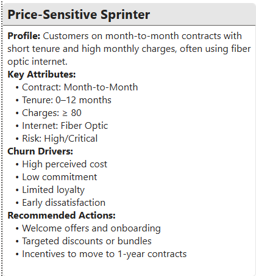
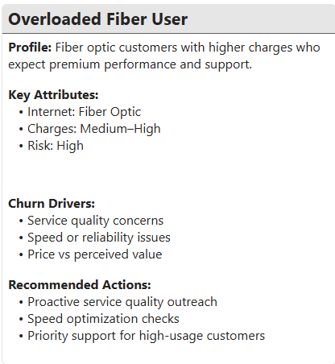
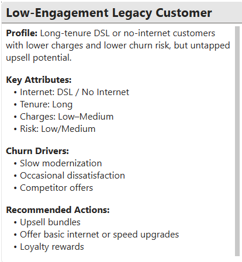

# Telco Customer Churn Prediction & Retention Strategy  
### An End-to-End Machine Learning & Power BI Solution  

**Author:** Robert Lopez  
**Tools:** Python • Scikit-Learn • Pandas • Power BI • DAX  

Data-driven churn prediction, risk segmentation, and retention strategy for telecom customers.

---

## 📌 Project Overview  
Customer churn is one of the most costly challenges in the telecommunications industry.  
This project delivers a complete churn management framework that integrates:

- Python-based data cleaning, feature engineering, and machine learning  
- Exploratory data analysis to uncover churn drivers  
- A unified dataset for BI consumption  
- A multi-page Power BI dashboard  
- Strategic retention recommendations  
- Human-readable customer personas  

The result is a scalable, interpretable, and business-ready solution that identifies at-risk customers, explains why they churn, and provides actionable strategies to reduce churn by an estimated **10–15%**.

---

## 🎯 Business Problem  
Telecom providers face churn driven by:

- Pricing pressure  
- Service dissatisfaction  
- Contract flexibility  
- Payment method friction  
- Fiber optic performance expectations  

Without a systematic approach to identifying at-risk customers, retention teams struggle to:

- Prioritize outreach  
- Allocate incentives effectively  
- Understand customer behavior  
- Reduce churn at scale  

**Objective:** Predict customer churn, understand its drivers, segment customers by risk, and deliver a Power BI dashboard that enables targeted retention strategies.

---

## 📊 Dataset Summary  
**Rows:** 7,032 customers  
**Features:** 21 attributes including demographics, account info, services, and billing details.

### 🔧 Feature Engineering  
- Tenure buckets  
- One-hot encoded categorical variables  
- Scaled numeric features  
- Preserved index for merging predictions  
- Dashboard-ready risk segmentation (Low, Medium, High, Critical)

> Note: The Power BI dashboard uses the test set (~1,400 rows) to reflect realistic model performance on unseen data.

---

## 🔍 Exploratory Data Analysis — Key Insights  

EDA revealed several strong churn patterns:

- Low tenure customers churn at the highest rate  
- Month-to-month contracts show significantly higher churn  
- Electronic check users churn more frequently  
- Higher monthly charges correlate with churn  
- Fiber optic customers churn more than DSL customers  

### 📈 Key Visuals

---

## 🤖 Modeling Summary  

Three models were trained and evaluated:

| Model | Accuracy | Recall (Churn) | ROC-AUC |
|-------|----------|----------------|---------|
| Logistic Regression | 0.80 | 0.57 | 0.836 |
| Random Forest | 0.80 | 0.60 | 0.824 |
| XGBoost | 0.78 | 0.53 | 0.820 |

### 🔥 Top Churn Drivers  

---

## 🗂 Unified Dataset for Power BI  

The final dataset includes:

- customerID  
- Actual churn label  
- Predicted churn probability  
- Risk segment (Low, Medium, High, Critical)  
- Tenure group  
- Monthly and total charges  
- Encoded contract, payment, and service attributes  

The dataset is generated in `Notebooks/Dashboard Prep.ipynb`.

---

## 📈 Power BI Dashboard Overview  

### Page 1 — Churn Overview  

### Page 2 — Risk Segmentation  

### Page 3 — Customer Insights  

### Page 4 — Retention Strategy  

### Page 5 — Customer Personas  

---

## 🧭 Strategic Recommendations  

1. Strengthen onboarding for new customers  
2. Promote long-term contracts  
3. Encourage automatic payment methods  
4. Investigate fiber optic service issues  
5. Offer pricing relief for high-charge customers  
6. Increase adoption of support/security services  
7. Prioritize outreach to High and Critical risk segments  

### 📘 Retention Playbook  

---

## 👥 Customer Personas  

---

## 📉 Expected Business Impact  
Implementing the recommended retention strategies is expected to:

- Reduce churn among high-risk customers by **10–15%**  
- Improve customer satisfaction  
- Increase contract stability  
- Reduce support costs  
- Improve lifetime value (LTV)  

---

## 🏁 Conclusion  
This project delivers a complete churn prediction and retention strategy solution that integrates:

- Machine learning  
- Exploratory analytics  
- Business intelligence  
- Strategic recommendations  
- Customer personas  

The result is a business-ready churn management framework that empowers telecom providers to:

- Identify at-risk customers  
- Understand churn drivers  
- Deploy targeted retention strategies  
- Improve customer satisfaction  
- Reduce churn at scale  

---

## 📎 Repository Structure  
├── Notebooks/  
│   ├── Cleaning.ipynb  
│   ├── EDA.ipynb  
│   ├── Feature Engineering.ipynb  
│   ├── Modeling.ipynb  
│   └── Dashboard Prep.ipynb  
│  
├── Data/  
│   ├── Raw/  
│   ├── Cleaned/  
│   ├── Engineered/  
│   ├── Modeling/  
│   └── Dashboard/  
│  
├── Images/  
│   ├── Dashboard/  
│   ├── Key Visuals/  
│   ├── Personas/  
│   └── Case Study Assets/  
│  
├── Telco Customer Churn Case Study.pdf  
└── README.md

## 👨‍💼 About the Analyst  
**Robert Lopez**  
U.S. Marine Corps Veteran • Biochemistry • Data Science • MBA Candidate
